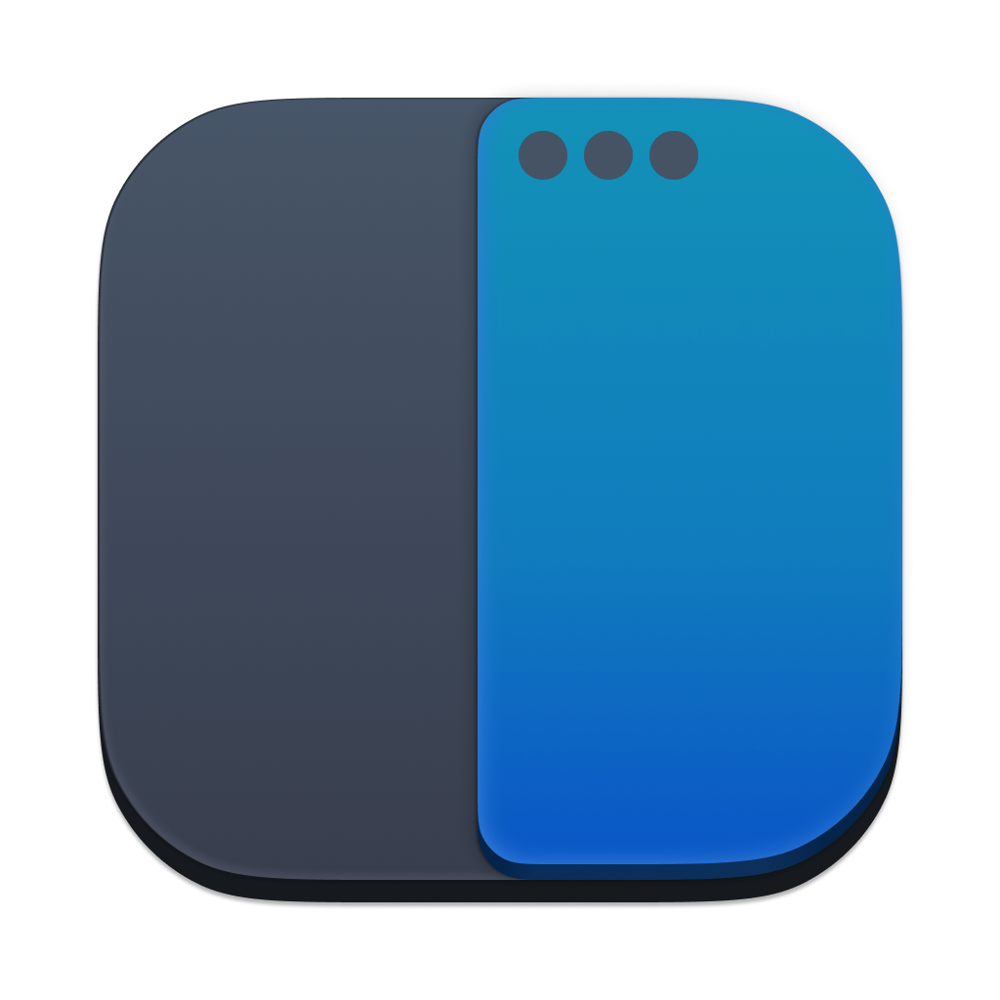

# Rectangle - 視窗管理工具 <Badge type="danger" text="macOS" /> <Badge type="warning" text="Homebrew" />

<p></p>

使用指令配置桌面應用程式的視窗位置與大小。

## 相依

* 僅可安裝於 macOS 作業系統。
* 使用 Homebrew 管理。

## 安裝

::: code-group

```ruby [Brewfile]
tap "homebrew/cask"
cask "rectangle"
```

:::

## 配置

```shellscript 
# 重複左右的指令時，視窗跳至同邊鄰近的螢幕上。
defaults write com.knollsoft.Rectangle subsequentExecutionMode -int 1
```

## 常用指令

::: tip 提示
指令會作用於當前的視窗上。
:::

* `⌃ ⌥ ▲` : 將視窗配置於螢幕**上**方 **1/2** 。
* `⌃ ⌥ ▼` : 將視窗配置於螢幕**下**方 **1/2** 。
* `⌃ ⌥ ◀︎` : 將視窗配置於螢幕**左**方 **1/2** ，重複此指令，視窗會跳至左方鄰近螢幕的右方 1/2 ，如果當前為第一台螢幕，則跳至最後一台螢幕。
* `⌃ ⌥ ▶︎` : 將視窗配置於螢幕**右**方 **1/2** ，重複此指令，視窗會跳至右方鄰近螢幕的左方 1/2 ，如果當前為最後一台螢幕，則跳至第一台螢幕。
* `⌃ ⌥ D` : 將視窗配置於螢幕第一個 **1/3** ，重複此指令，視窗會跳至下個 1/3 。
* `⌃ ⌥ E` : 將視窗配置於螢幕第一個 **2/3** ，重複此指令，視窗會跳至下個 2/3 。
* `⌃ ⌥ ⏎` : 將視窗最大化。

## 慣用方式

在開發時，我習慣將終端機與瀏覽器都最大化，其他比較次要的視窗，像是通訊軟體就會以 1/2 的大小放置，但是有些軟體在較小的視窗中會隱藏部分的功能，因此有時會配置 2/3 的大小，如果有多個次要視窗，則會交錯配置，例如左 2/3 是 Outlook ，右 2/3 是 Teams ，如此一來就可以注意到是否有訊息及郵件的更新。

如果是有需要做筆記的場景時，會將備忘錄放於右 1/3 ，左邊 2/3 留給做筆記的對象。

## 延伸閱讀

* [02 - Rectangle - 視窗管理工具 | 尋覓網站開發的神兵利器 | 2021 iThome 鐵人賽 | iT邦幫忙](https://ithelp.ithome.com.tw/articles/10266526)
* [Rectangle Terminal Commands for Hidden Preferences | rxhanson/Rectangle | GitHub](https://github.com/rxhanson/Rectangle/blob/master/TerminalCommands.md)
